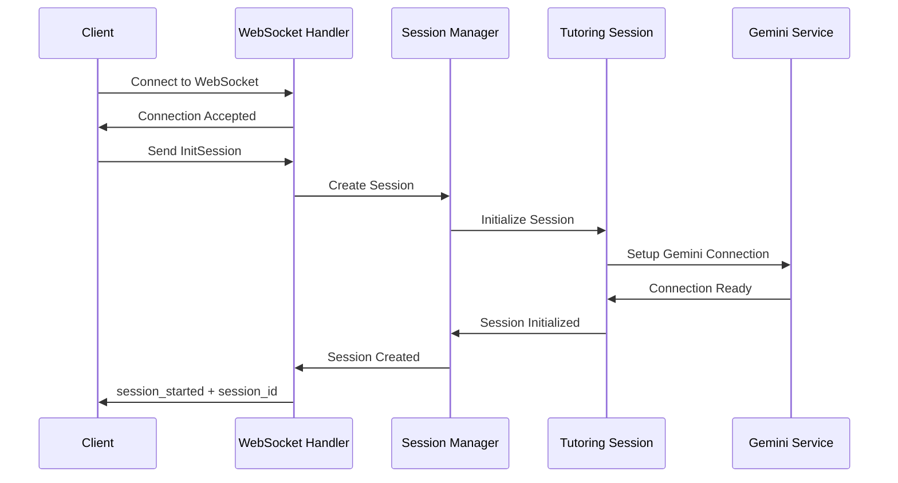
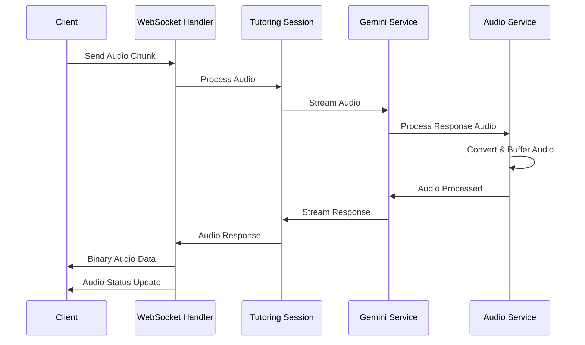
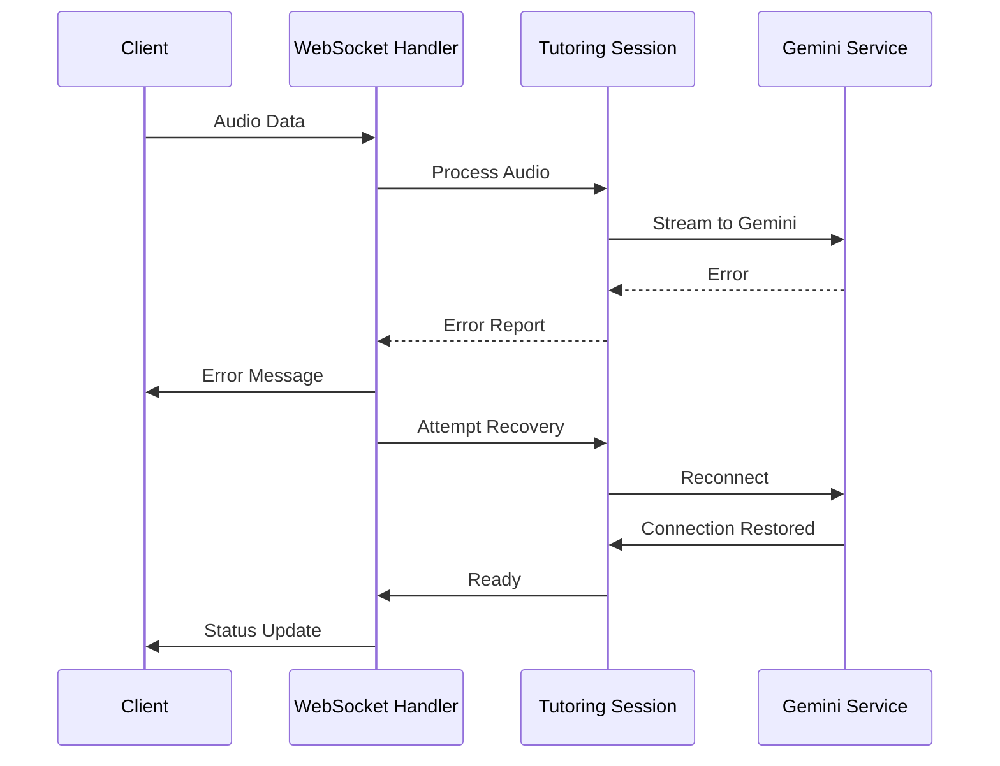

# AI Tutor API Documentation

## WebSocket API Reference

### Base URL
```
wss://your-domain/api/tutoring/session
```

### 1. Session Initialization

Establishes a new tutoring session with specified parameters.

#### Request
```javascript
{
    "text": "InitSession",
    "data": {
        "subject": string,        // Subject area (e.g., "math")
        "skill": string,         // Main skill (e.g., "counting")
        "subskill": string,      // Specific subskill (e.g., "numbers 1-10")
        "student_id": number,     // Unique student identifier
        "competency_score": number // Student's current competency (0-10)
    }
}
```

#### Response
```javascript
{
    "type": "session_started",
    "session_id": string        // Unique session identifier
}
```

#### Error Response
```javascript
{
    "type": "error",
    "message": string          // Error description
}
```

### 2. Audio Stream

Sends audio data for processing.

#### Request
```javascript
{
    "realtime_input": {
        "media_chunks": [{
            "mime_type": "audio/pcm",
            "data": string       // Base64 encoded audio data
        }]
    }
}
```

#### Response
Binary audio data chunks followed by status messages:
```javascript
{
    "type": "audio_status",
    "status": "streaming"
}
```

### 3. Session Management

#### Reset Session
```javascript
{
    "text": "ResetSession"
}
```

#### Response
```javascript
{
    "status": "session_reset"
}
```

## Sequence Diagrams

### 1. Session Initialization Flow



### 2. Audio Processing Flow



### 3. Error Handling Flow



## Audio Specifications

### Input Audio Requirements
- Format: PCM
- Sample Rate: 16000 Hz
- Channels: 1 (Mono)
- Encoding: Linear16

### Output Audio Specifications
- Format: PCM
- Sample Rate: 24000 Hz
- Channels: 1 (Mono)
- Buffer Size: 8192 bytes
- Latency: 0.1s

## Status Codes and Error Messages

### WebSocket Status Codes
- 1000: Normal closure
- 1001: Going away
- 1011: Internal error
- 4000: Invalid session
- 4001: Authentication failed
- 4002: Invalid audio format

### Error Types
```typescript
type ErrorResponse = {
    type: "error";
    message: string;
    code?: number;
    details?: {
        reason: string;
        recoverable: boolean;
        retry_after?: number;
    };
}
```

## Client Implementation Examples

### TypeScript/React Implementation
```typescript
// Initialize WebSocket connection
const tutoringWS = new TutoringWebSocket(
    'wss://api.example.com/tutoring/session',
    {
        onAudio: (audioData: ArrayBuffer) => {
            // Handle audio response
            playAudio(audioData);
        },
        onStatus: (status: string) => {
            console.log('Status:', status);
        },
        onError: (error: string) => {
            console.error('Error:', error);
        }
    }
);

// Start session
await tutoringWS.connect({
    subject: "math",
    skill: "counting",
    subskill: "numbers 1-10",
    student_id: 123,
    competency_score: 7.0
});

// Send audio
const audioChunk = await getAudioFromMicrophone();
tutoringWS.sendAudio(audioChunk);
```

### Error Handling Example
```typescript
try {
    await tutoringWS.connect(config);
} catch (error) {
    if (error.code === 4001) {
        // Handle authentication error
    } else if (error.code === 4002) {
        // Handle invalid audio format
    }
}
```

## Rate Limits and Quotas

- Maximum session duration: 60 minutes
- Maximum audio chunk size: 64KB
- Rate limit: 100 requests per minute
- Concurrent sessions per user: 1

## Best Practices

1. Audio Handling
   - Buffer audio in chunks of 8192 bytes
   - Monitor audio levels before sending
   - Handle network latency gracefully

2. Error Recovery
   - Implement exponential backoff for reconnection
   - Cache unsent audio during disconnections
   - Maintain session state for recovery

3. Resource Management
   - Close unused WebSocket connections
   - Clean up audio resources
   - Monitor memory usage

4. Performance Optimization
   - Use appropriate audio buffer sizes
   - Implement client-side audio compression
   - Monitor network conditions