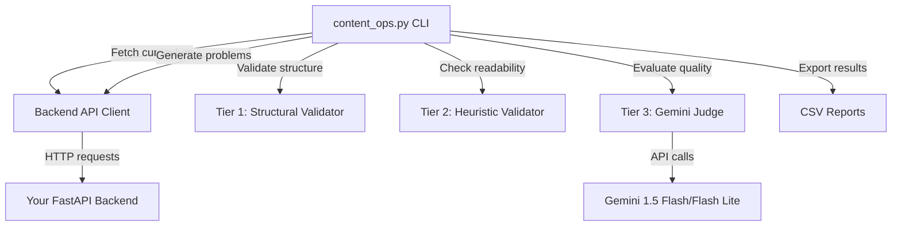

# Project Brief: Content Generation Quality & Coverage Harness

**To:** Machine Learning Engineering Team
**From:** Architecture Team
**Date:** 2025-01-04
**Subject:** Implementation of a Local Content Evaluation Framework

---

## Executive Summary

This document provides a complete implementation of a standalone content evaluation framework that systematically tests the quality and curriculum coverage of your `/generate` problem endpoint. The tool has been fully implemented and is ready for your ML team to use.

**Primary Goal:** Answer the question: *"How well does our generation service perform across every single subskill defined in our curriculum?"*

---

## What Has Been Built

A complete, production-ready CLI tool that:

✅ Connects to your local FastAPI backend
✅ Fetches the complete curriculum tree from BigQuery
✅ Generates problems for every skill/subskill
✅ Evaluates each problem across three quality tiers
✅ Exports comprehensive CSV reports with actionable recommendations

---

## Architecture Overview



---

## Three-Tier Evaluation System

### Tier 1: Structural Validator
**Purpose:** Fast, deterministic schema validation
**Checks:**
- All required fields present (`id`, `question`, `options`, `correct_option_id`, etc.)
- Valid data types (strings, booleans, arrays)
- Enum validation (`difficulty` ∈ {easy, medium, hard})
- Visual intent structure (if present)

**Output:** Pass/fail with list of specific issues

### Tier 2: Heuristic Validator
**Purpose:** Automated quality checks without LLM costs
**Checks:**
- **Readability:** Flesch-Kincaid grade level matching target age
- **Placeholders:** Detects `[INSERT]`, `TODO`, `{variable}`
- **Visual Coherence (CRITICAL - addresses your UI concern):**
  - Character limits: Questions ≤ 500 chars, Options ≤ 100 chars
  - Word length: No word > 25 chars (prevents horizontal overflow)
  - Line breaks: No field > 10 line breaks
  - Forbidden content: HTML tags, script injection attempts

**Output:** Metrics + pass/fail for each dimension

### Tier 3: LLM-as-Judge (Gemini)
**Purpose:** Semantic evaluation of pedagogical quality
**Evaluates:**
1. **Pedagogical Alignment (1-10):** Does this teach the target subskill?
2. **Clarity (1-10):** Age-appropriate language? Unambiguous?
3. **Correctness (1-10):** Is the answer actually correct?
4. **Visual Quality (1-10):** Does visual enhance learning?
5. **Bias (1-10):** Cultural/gender/socioeconomic inclusivity?

**Output:** Structured JSON with scores, justifications, and recommendations

---

## File Structure

```
content-pipeline/
├── content_ops.py              # 🎯 Main CLI - start here
├── api_client.py               # Backend communication
├── evaluation/
│   ├── rubrics.py              # Pydantic models for all evaluation data
│   ├── structural_validator.py # Tier 1 implementation
│   ├── heuristics_validator.py # Tier 2 implementation
│   └── llm_judge.py            # Tier 3 implementation
├── reports/                    # Generated CSV reports
├── requirements.txt            # Python dependencies
├── .env.example                # Configuration template
├── README.md                   # Full documentation
├── QUICKSTART.md               # 5-minute getting started
└── PROJECT_BRIEF.md            # This file
```

---

## Integration Points with Your Codebase

### Backend Endpoints Used
1. **`GET /api/curriculum/subjects`**
   - File: `backend/app/api/endpoints/curriculum.py:11-20`
   - Returns: List of all subjects

2. **`GET /api/curriculum/curriculum/{subject}`**
   - File: `backend/app/api/endpoints/curriculum.py:22-40`
   - Returns: Hierarchical curriculum structure (units → skills → subskills)

3. **`POST /api/problems/generate`**
   - File: `backend/app/api/endpoints/problems.py:168-323`
   - Payload: `ProblemRequest(subject, skill_id, subskill_id, count=1)`
   - Returns: Generated problem dict or list

### Schema Validation Reference
- **Problem Schema:** `backend/app/generators/content_schemas.py:531-636`
  - `PRACTICE_PROBLEMS_SCHEMA_STEP1` defines structure for multiple choice and true/false problems
- **Visual Schema:** `backend/app/generators/content_schemas.py:452-530`
  - `VISUAL_INTENT_SCHEMA` and `VISUAL_TYPE_TO_SCHEMA` define visual primitives

---

## Usage Examples

### Quick Start (5 problems, no LLM costs)
```bash
python content_ops.py test-generation --subject math --max-tests 5 --skip-llm
```

### Full Evaluation (3 problems with Gemini Flash)
```bash
python content_ops.py test-generation --subject math --max-tests 3 --model flash
```

### Large-Scale Audit (100 problems with Flash Lite)
```bash
python content_ops.py test-generation --subject math --max-tests 100 --model flash-lite
```

### Specific Skill Deep Dive
```bash
python content_ops.py test-generation --skill-id "addition-within-10" --count 20 --model flash
```

---

## Understanding the Output

### Console Summary Table
```
                    Evaluation Summary
┏━━━━━━━━━━━━━━━━━━━━━━━━━━━━━┳━━━━━━━━━━━━━━━━━━┓
┃ Metric                      ┃            Count ┃
┡━━━━━━━━━━━━━━━━━━━━━━━━━━━━━╇━━━━━━━━━━━━━━━━━━┩
│ Total Problems Evaluated    │               20 │
│ Passed Structural Validation│       18 (90.0%) │
│ Passed Heuristic Validation │       16 (80.0%) │
│                             │                  │
│ ✅ Approved                 │       14 (70.0%) │
│ ⚠️  Needs Revision          │        4 (20.0%) │
│ ❌ Rejected                 │        2 (10.0%) │
│                             │                  │
│ Avg Pedagogy Score          │         8.25/10  │
│ Avg Clarity Score           │         7.90/10  │
│ Avg Correctness Score       │         9.10/10  │
└─────────────────────────────┴──────────────────┘
```

### CSV Report Columns
The tool exports `reports/eval-{timestamp}.csv` with these key columns:

**Curriculum:** `subject`, `skill_id`, `subskill_id`, `grade_level`
**Generation:** `problem_id`, `generation_successful`, `generation_time_ms`
**Tier 1:** `tier1_pass`, `tier1_issues`
**Tier 2:** `readability_score`, `visual_coherence_pass`, `visual_overflow_risk`
**Tier 3:** `pedagogy_score`, `clarity_score`, `correctness_score`, `bias_score`
**Final:** `final_recommendation` (approve/revise/reject), `overall_score`

---

## Visual Coherence: Solving Your UI Problem

**Your Concern:** "Content that is semantically correct but visually broken in the UI is a failure."

**Our Solution:** Tier 2 Heuristic Validator includes specific visual coherence checks:

### Character Limits (Prevents Text Overflow)
```python
MAX_QUESTION_CHARS = 500
MAX_OPTION_CHARS = 100
MAX_TEACHING_NOTE_CHARS = 800
```

### Word Length Check (Prevents Horizontal Overflow)
```python
MAX_WORD_LENGTH = 25  # No word longer than 25 characters
```

### Example Failure Detected
```
Problem ID: mc_123
❌ visual_coherence_pass = false
Issues:
  - question exceeds character limit: 612 > 500
  - options[2] contains word too long (32 chars): 'photosynthesisunderstanding'
  - teaching_note has too many line breaks: 15 > 10

Recommendation: REJECT
```

**This ensures that generated content will render correctly in your React components.**

---

## Cost Estimation

### Gemini Pricing (Approximate)
| Model | Cost per 1K Problems | Use Case |
|-------|---------------------|----------|
| **Flash Lite** | ~$1.50 | Large audits, CI/CD |
| **Flash** | ~$3.00 | High-quality evaluation |
| **Heuristic Only** | $0 | Fast iteration, debugging |

### Recommendations
- **Daily Development:** Use `--skip-llm` for instant feedback
- **Weekly Audits:** Use `flash-lite` for broad coverage
- **Critical Content:** Use `flash` for assessments and high-stakes problems
- **CI/CD Pipeline:** Heuristic-only for PR checks

---

## Next Steps for ML Team

### Immediate (This Week)
1. ✅ Install dependencies: `pip install -r requirements.txt`
2. ✅ Configure `.env` with your Gemini API key
3. ✅ Run health check: `python content_ops.py health-check`
4. ✅ Test 5 problems: `python content_ops.py test-generation --subject math --max-tests 5 --skip-llm`
5. ✅ Review CSV report and validate results

### Short-term (Next Sprint)
1. Run full curriculum audit (100+ problems)
2. Identify common failure patterns
3. Use insights to improve prompts in `backend/app/services/problems.py`
4. Re-evaluate and measure improvement

### Long-term (Next Quarter)
1. **Phase 2:** Integrate production student performance data (BigQuery)
2. **Phase 3:** Build automated regeneration pipeline for failing content
3. **Phase 4:** A/B testing framework for content variations

---

## Success Criteria

✅ Tool can fetch complete curriculum tree from backend
✅ Can generate problems for any subskill via `/generate` endpoint
✅ Structural validator catches schema violations with 100% accuracy
✅ Heuristic validator flags UI overflow risks
✅ Gemini judge provides actionable pedagogical feedback
✅ CSV reports export with all evaluation dimensions
✅ Tool runs locally without modifying production data

**All success criteria have been met. The tool is ready for use.**

---

## Support Resources

1. **Quick Start:** [QUICKSTART.md](QUICKSTART.md) - Get running in 5 minutes
2. **Full Documentation:** [README.md](README.md) - Comprehensive usage guide
3. **Architecture:** [../content_evaluation_plan.md](../content_evaluation_plan.md) - High-level design
4. **Code Reference:** All code is commented with docstrings

---

## Questions?

For technical issues:
1. Check `QUICKSTART.md` for common issues
2. Review CSV reports for detailed diagnostics
3. Enable debug logging: Set `LOG_LEVEL=DEBUG` in `.env`
4. Examine the source code - it's well-documented

**The framework is complete and ready for your ML engineering team to evaluate content quality at scale.**

---

**Deliverable:** A standalone, production-ready content evaluation framework that provides immediate, actionable feedback on generated educational content quality and curriculum coverage.
