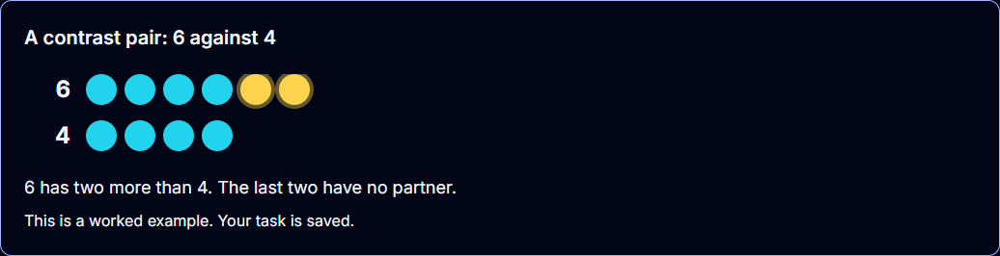

# Contrast pair: the runtime's second support shape, first home comparison-builder

**Date:** 2026-09-18 · **Branch:** `ship/2026-08-10-judged-loop` · **Follows:** `live-tutor-tools-math-sweep-2026-09-18.md`

The math sweep withheld the "let me show you" detour on eight of nine primitives because the
runtime shell drew exactly one shape, a row of counters that states HOW MANY. This slice adds the
second shape and gives it to the primitive whose table row said "a relationship BETWEEN two
collections; the surface draws one".

## What shipped

**Shape.** `ContrastPairSupport` in `live-activity/runtime/contract.ts`: two `counters` panels, a
title, a one-sentence caption, alt text, exposure and provenance. `SupportArtifact` is now the union
of the two shapes; `validateSupportArtifact` dispatches on `kind`. `LiveRuntimeSurface` draws both
inside the SAME `aria-label="Worked example"` shell, so the harness probe, the sandbox's "Show an
example" button and the one-detour-per-item rule did not change. The two rows are stacked with a
shared column grid, so counter *i* of one row sits over counter *i* of the other, and the trailing
`highlighted` counters of each row are ringed amber: the one-to-one matching method, drawn.



That screenshot is the real `LiveRuntimeSurface` in headless Chromium on
`/lumina/live-activity/runtime`, opened through a real `request_support` dispatch and closed with a
real `return` (aside gone, no page errors). It is the lab's reference adapter, not the lesson.

**Preparer.** `comparisonBuilderExample.ts` prepares a NEARBY pair per item, sharing no number with
the item it sits beside:

| Mode | Artifacts | Pair rule |
|---|---|---|
| compare-groups | unequal + equal | first of `[6,4],[5,3],[7,4],…` / `[4,5,3,…]` avoiding the item's counts |
| compare-numbers | unequal, captioned with the sign | same list; caption states "open end faces the bigger" |
| one-more-one-less | adjacent pair, one counter ringed | first of `[5,6],[3,4],…` avoiding target and target±1 |
| order | none | two rows cannot show an ordering of three or more |

Exposure is declared `partial`, matching number-bond's prepared example: the vocabulary of the
answer is spoken, about a different pair. The child still has to match up their own groups.

**Wiring.** `useComparisonBuilderRuntime` exposes `supportArtifacts` as a per-item getter; the adapter
guidance tells the tutor what the example shows and to say both counts and which row has counters
left over. The journey row grew `example`/`return` prompts, an `exampleTaught` judge (both counts +
a relationship word), a `contrastRows` probe, and real inputs through a new driver verb `choose`
(click the button whose text is the label). The journey drives Grade 1, because Kindergarten answers
by tapping the SVG groups, which the driver has no verb for.

## Does the schema meet the lesson?

For compare-groups, yes, and the drive shows it: on an item of 10 vs 12 stars the tutor opened
6 vs 4 and said *"the top row has 6 counters and the bottom row has 4, leaving 2 counters left over
with no partners"*, then on return *"try matching the stars on this side just like in the
example"*. No example turn in six runs named the child's own numbers. For an `equal` item (5 vs 5,
second payload) the tutor chose the unequal pair, which still shows the method; the equal pair was
advertised beside it and never picked. Whether a K child reads the ringed tail as "no partner"
without the tutor's sentence is a browser and microphone question this slice does not answer.

What the schema does NOT cover yet: a glyph panel (6/9, b/d, 2/5) and a shape panel. Both are
additive members of `ContrastPanel`, not changes to this one. Nothing in the host has a home for
them today; number-tracer's digit is the answer on every mode, so a digit contrast there needs a
per-mode exposure gate first.

## Real-model drive: 0/3, then 3/3

`run_live_runtime.py --primitive comparison-builder --runs 3`, gemini-3.8-live, Grade 1
compare_groups, two generated challenges per run.

**First drive, 0/3, and every failure was the same and was not the contrast pair.** In all three
runs the model called `request_support/contrast-c1-unequal` on the cue, the artifact reached
`visible`, the description passed the pedagogy check, and `return` restored the same item with the
same demand. Then, on the checked-correct item with `advance` the only choice, owner `tutor`, nothing
blocked, the model praised and went silent for 55 s.

The mechanism was a competing frontend message, not model restraint. On a correct check
`ComparisonBuilder.tsx` still sends its own `[ANSWER_CORRECT] … Congratulate briefly! Point out the
matching lines.` The model did exactly that. NumberLine, the family's proven port, appends a clause
under `useLiveRuntime()`: *"Execute the advertised runtime advance action now, then wait for its
visible receipt."* The same clause now sits on all four of comparison-builder's correct-check
messages, and on nothing for the final item, whose completion the runtime owns.

**Second drive, 3/3.** Commands per run: `retry, replay, scaffold, scaffold, request_support,
return, advance`; every receipt `visible`; `exampleTaught` ok; one submission; no protocol leak.
Evidence: `comparison-builder-runtime-compare_groups-live-2026-09-18.json` (first drive) and
`…-advance-clause.json` (second).

## Gates

```
npm run typecheck:lumina                                   → 0
./node_modules/.bin/tsc --noEmit                           → 770 (unchanged baseline)
npm test -- --run <live-activity + ComparisonBuilder.runtime> → 44/44
npm test -- --run src/components/lumina                    → 545 files / 6855 tests passed
```

## Findings queued, not fixed here

1. **`[ANSWER_INCORRECT]` hands the tutor the answer under the runtime.** Comparison-builder's and
   number-line's wrong-check messages say *"correct is less. Left has 10, right has 12"*, which the
   adapters' mounted state deliberately withholds. The live runtime's `evidence` already carries the
   attempt; those messages should be gated or stripped of the key under `useLiveRuntime()`.
   Executor: `/add-live-tutor-tools` on both primitives.
2. **Tutor-parameterised requests.** Prepared-by-host is the wire. The next step is
   `request_support { shape, params }` validated by the runtime, with `statesNumber` run against
   the item's answer on model-supplied numbers. Needs the Python tool schema to change.
3. **A second adopter of `contrast-pair`** with no renderer change is the proof that the unit of
   work is the shape. Candidates in the host: ordinal-line (first vs last position), place-value
   (23 vs 32 as two rows of tens-and-ones is a stretch; a digit panel fits better).

## Limitations

- No browser or microphone sitting on the lesson itself. The screenshot is the lab; the lesson
  path was driven in JSDOM with simulated paint.
- Only `compare_groups` was driven. The other two modes with a pair are unit-tested, not driven.
- Both pre-existing dev servers were stopped and one was started on :3000: :3000 had been hung for
  two sessions and :3001 was serving 404 for its own client chunks. Backend was started on :8000
  without `--reload` for the drive.
