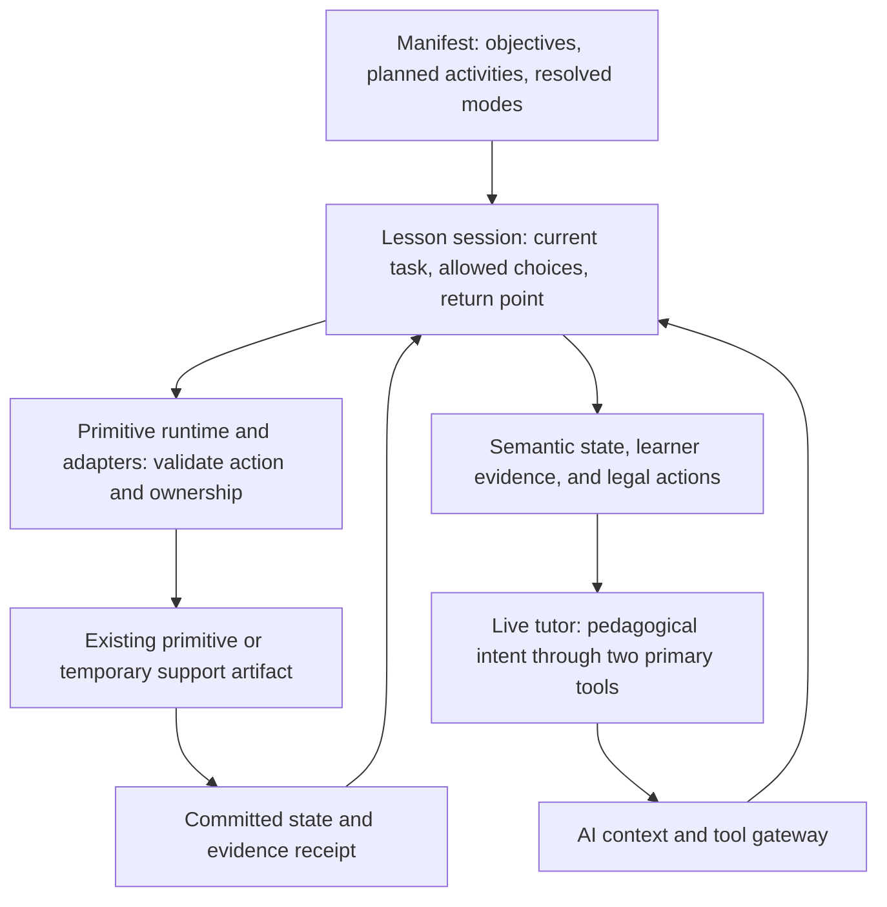

# Live lessons: vision, experiments, and rollout

Status: design revision v0.2, 2026-09-17, incorporating the supplied Aristotle/pedagogical-control/support-visual conversation. User-selected first demonstration remains **a short planned lesson with a help detour and return**. Implementation and evidence were inspected in the working tree, including uncommitted sandbox work. This document proposes future behavior; it does not certify that behavior or authorize a production rollout.

**Latest adoption, 2026-09-17: Number Line and repeatable tutor tools.** The existing
`/lumina/live-activity` tester now selects TenFrame or Number Line and uses the shared
support shell for either. Number Line implements checked advance, retry, focused
instruction replay, a jump reminder/fade pair and a prepared subtraction example
with unchanged-work return. Imperative actions acknowledge the actual React commit;
the transport still waits separately for visibility. Planned completion is held
until runtime settlement, and objective/resolved mode metadata is retained.
[Evidence and limits](../../../../qa/tutor-reports/number-line-runtime-live-2026-09-17.md),
[next-session handoff](../../../../qa/live-runtime-handoffs/05-primitive-tools.md), and
[add-live-tutor-tools skill](../../../../qa/live-runtime-handoffs/add-live-tutor-tools/SKILL.md)
now provide the replication path. The driver supports both actual execution families.
Both planned orders, human microphone acceptance and teaching-policy quality remain
separate open gates; a tool receipt does not certify the tutoring experience.

**Earlier TenFrame implementation, 2026-09-17:** the user authorized promotion into the shared
judged runner and TenFrame. This bounded adoption is now in `/lumina/live-activity`:
actual voice judging, scoped runtime help, preserved frame return and completion
after closing speech. [Three real-model journeys through the mounted component passed](../../../../qa/tutor-reports/ten-frame-runtime-live-2026-09-17.md).
Browser/microphone acceptance, number-line adoption and the combined planned lesson
in both orders remain open. Historical fixture evidence below does not close them.

**Backend ownership follow-up:** [host capability migration](../../../../qa/tutor-reports/live-host-capabilities-2026-09-17.md)
removes Python's primitive-specific tool instructions, mode catalog, identity-based
speech handoff and direct-visual data builders. Existing frontend registrations now
publish modes, teaching owner, controls, guidance and visual schemas. The backend
validates that envelope and applies generic session/receipt rules. This does not
certify additional primitive runtime adapters or close the two-order lesson gate.

## Product direction

Lumina leads one continuous tutoring conversation around a shared workspace. A manifest gives the lesson its objectives and intended route. Lumina can start the planned activity, help with the current task, take a short teaching detour, and return. The learner should experience a tutor using learning materials, with no need to manage the application between every turn.

The manifest is the planned route. Runtime decisions can change the route within explicit limits while preserving the objective, student work, and evidence of what actually happened. A skipped task remains unfinished; a demonstration remains teaching; a correct independent response remains evidence.

**Design principle: predictable continuity with bounded responsiveness.** Keep the planned lesson as the default. The tutor reasons in pedagogical actions; a shared primitive runtime translates those requests into supported behavior. Adapt when the evidence warrants it, and leave productive independent work alone. Agent controllability is a separate capability to add to existing primitives, not evidence that their current learning interactions need replacing.

There are three instructional resources: engineered interactive primitives, supported mutations of the active primitive, and temporary support artifacts assembled or generated on demand. They share one lesson/session boundary. A support artifact can provide the “let me show you” moment without becoming a new scored activity or replacing the entire screen.

**First product proof:** a short Grade 1 subtraction lesson. Lumina launches number-line `jump` practice, responds to “I don't know where to start” with one focused help turn, returns to the same problem, and proceeds after the learner completes it. Follow with a new, unassisted item to see whether the help transferred. Values in this description are illustrative; the demo must teach from its actual mounted payload.

Test a second execution style with the existing ten-frame DI runner before declaring the approach reusable. The goal is a convincing five-minute lesson before a broad catalog integration.

## Design decisions for v0.2

| Question | Recommendation | Boundary |
|---|---|---|
| A separate tool for every primitive? | Retain two primary pedagogical tools: start/select a primitive and act on the current primitive. Back them with a shared runtime protocol and per-family adapters. | Primitive-specific rendering, validation, and teaching semantics still need implementations. A generic tool name cannot remove that work. |
| A generation call for every teaching move? | Generate at activity boundaries; use validated local actions for pointing and supported scaffolds. Reuse prepared manifest content. | A new task may need generation. A point, replay, or supported transition should not. |
| Who selects the evaluation mode? | Reuse the manifest's resolved mode; resolve only new detours from the current objective and candidate catalog modes. | The live tutor expresses the teaching need. It does not silently redefine the skill or use mode beta as an easier/harder menu. |
| Simple or fully wired primitives? | Keep full primitives for practice; use small visual surfaces for brief explanations. Prefer a short execution window of an existing primitive for a scored microtask. | Do not create a parallel assessment framework for every simple visual. Promote one only when a demonstrated learning interaction needs it. |
| Can Lumina move on when a child is frustrated? | Yes: request help, a break, or a supported skip with an explicit reason. | A skip is not correct completion. The primitive/runner validates the transition; the model never increments a phase index itself. |
| Must all multi-phase primitives change now? | No. Adopt by execution family, starting with number-line and the shared judged runner through ten-frame. | Advertise only tested capabilities. Unsupported controls are unavailable, with a clear fallback. |
| Can the tutor improvise indefinitely? | Initially, allow one bounded help detour with a return destination. | No nested detours or automatic regeneration loop. If help fails, offer an easier task, a break, or ending the activity. |
| How does the tutor discover scaffolds? | Publish semantic state plus currently legal actions, scaffold strategies, and difficulty dimensions from the mounted adapter. | Catalog declarations alone do not authorize a mutation. Unsupported or phase-inappropriate actions stay unavailable. |
| Can the tutor ask for a bespoke visual? | Yes: request a temporary support artifact through the current-activity tool; use structured renderers for exact diagrams and a separately gated image provider for illustrations. | The engineered shell owns layout and return. Image-generation speed, correctness, and usefulness are hypotheses to measure. |

These are iteration defaults, not settled product policy. The first choices to revisit are how much routing autonomy feels helpful, whether help should sit beside or replace the main surface, and when learners prefer an explicit choice before moving on.

## What is already real

| Foundation | Working-tree evidence | What remains unproven |
|---|---|---|
| Tutor-requested generation and same-session replacement | [Sandbox](../components/live-activity/LiveActivitySandbox.tsx), [activity contract](../components/live-activity/activityContract.ts), [generation route](../../../app/api/lumina/live-activity/route.ts) | Return from a detour and catalog-wide support. The generation route currently pins `difficulty: 'easy'`. |
| Prepared manifest plans and two initial adapters | [Plan projection](../components/live-activity/livePlan.ts), [plan tests](../components/live-activity/LiveActivitySandbox.plan.test.tsx), [phase-1 evidence note](../../../../qa/tutor-reports/live-lesson-plan-2026-09-17.md) | The sandbox mounts prepared plan items in order and has number-line/ten-frame adapters. Their current contract exposes validation, initial state, and teaching owner; it does not yet provide the universal action/affordance protocol below. Completion and handoff are not yet predictable (gaps G1–G3 below). Human acceptance remains pending. |
| Receipt-based visibility and guarded commands | [Backend bridge](../../../../../backend/app/services/live_activity_tools.py), [advance report](../../../../qa/tutor-reports/live-activity-advance-2026-09-16.md) | General item/phase revisions and pause/skip commands. Number-line advances only after checked correctness. |
| Immediate counters, fractions, and letter tiles | [DirectVisual](../components/live-activity/DirectVisual.tsx), [visual report](../../../../qa/tutor-reports/live-visual-tools-2026-09-16.md) | Resumable help and verified grading. A show call currently replaces the workspace and clears prior work. |
| Full ten-frame lesson with one teaching owner | [Ten-frame report](../../../../qa/tutor-reports/live-ten-frame-2026-09-16.md) | A real microphone sitting for the new sandbox startup; the reported live drives used text answers and simulated browser receipts. |
| Shared correction and progression policy | [Judged runner](../hooks/useJudgedScriptRunner.ts) | General pause/resume/skip interface. The runner already caps corrections, moves on, tracks outcomes, and gates voice ownership by active instance. Focus gating alone does not prove every timer or gesture safely pauses. |
| Lesson-wide evaluation-mode selection | [Lesson resolver](../service/manifest/resolveLessonEvalModes.ts), [generator resolver](../service/evalMode/index.ts), [manifest generation](../service/manifest/gemini-manifest.ts) | A strict runtime selection boundary for live detours. The generator resolver can fall back to mixed on unknown modes or resolution failure. |

The current backend filename is `backend/app/services/live_activity_tools.py`. The older manifest architecture guide is useful background, but the current code uses objective blocks and a separate mode-resolution stage. The TypeSafe selection experiment is an optional candidate-ranking input, not a prerequisite for this roadmap.

Existing reports establish useful automated behavior, not that the lesson feels natural. Their frontend tests and live text drives must not be described as real microphone/browser acceptance. No tests or live sessions were rerun for this planning document.

## Runtime shape



Keep curriculum and mode semantics in the existing TypeScript catalog/generation layer. Evolve the Python bridge into transport and correlation rather than growing its current primitive/mode tables. The authenticated application creates the allowed capability set; a model-supplied descriptor cannot authorize itself.

Retain **two primary pedagogical tools**. The conversation's names below describe the target interface; they are not claims about current wire names:

1. **`new_primitive`: start/select an activity.** Prefer an opaque prepared plan-item ID. A bounded alternate-representation request supplies objective ID, purpose, and teaching intent to the existing selection/generation path. Only expose a short list of eligible choices. Changing representation or taking a prerequisite detour passes through session selection policy.
2. **`advance_current_primitive`: act within the current instructional experience.** This is a typed command dispatcher, not just “next phase.” It can request advance, retry, replay, point, scaffold/fade, an easier/harder instance, or temporary visual support when advertised. Return, dismiss support, skip/defer, and finish are explicit session-validated action variants under this same surface; a third primary return tool is unnecessary.

Today the bridge uses `request_activity`, `start_plan_item`, and `advance_activity`, plus separate visual tools. Consolidate their semantics behind the shared protocol incrementally; do not break a working transport merely to rename tools. Internal artifact generation may use another service/tool without expanding the tutor's primary decision surface. Use a discriminated action union with action-specific parameter schemas, not an unrestricted `action: string` plus arbitrary data.

The AI context service is the facade for registration, routing, and context publication. It does not implement primitive mutations. Evolve the existing `LiveActivityAdapter` into a mounted runtime contract along these lines (proposed names):

```ts
interface PrimitiveRuntime {
  getTutorState(): TutorPrimitiveState;
  getAffordances(): TutorAffordances;
  dispatchTutorAction(command: TutorCommand): Promise<PrimitiveTransition>;
}
```

Each adapter connects actions to the same validated transitions used by learner controls or the runner. Register/unregister by active instance and clean up handlers on unmount. A universal hook provides access to capabilities; it cannot make a primitive advanceable without an implementation. Certify one family first, then wrap others gradually. An adapter supporting only advance/retry is valid. Return a typed unsupported/blocked result and refreshed legal choices when an action cannot run; the session may offer an eligible alternative without silently switching activities.

The session tracks a small plan separately from mounted activity state: objective, current plan item, pending preparation, current teaching owner, at most one suspended parent, and outcomes. For the first prototype, preserve the parent component in memory while help is displayed, after explicitly suspending its runner. Do not pretend that remounting the same JSON restores an unfinished interaction. Durable checkpoint/reconnect recovery is a later gate.

Each mutation carries session epoch, command ID, instance ID, item ID, and expected state revision. Receipts return the committed revision, visible state, teaching owner, and available actions. Reject stale, duplicate, unsupported, and conflicting requests. Item/phase transitions must be safe against a late verdict, delayed generation, or simultaneous learner action. A successful tool dispatch is not a successful screen transition.

One owner controls the teaching turn at a time. A DI runner can own its ask, judgment, correction, and progression; the conversational tutor cannot advance it concurrently. A help handoff must settle or cancel queued cues, pending judgments, gesture commits, and stimulus timers before granting ownership elsewhere. Resuming establishes a new revision so late help responses cannot affect the parent.

## Affordances, evidence, and local adaptation

Publish a compact context packet when an activity mounts, after meaningful learner interactions, and after committed tutor actions. It must describe the task semantically, not expose only React fields such as `selectedIndex`:

| Packet field | Required meaning |
|---|---|
| Task and ownership | Objective, resolved mode, instance/item/phase/revision, teaching owner, and a plain-language statement of what the learner is trying to do. |
| Learner evidence | Attempt number, checked correctness or unknown, response latency when available, hints/support used, a short recent response history, and observed error patterns with provenance/uncertainty. Separate audio-recognition uncertainty from conceptual errors. |
| Current demand/support | Structural setting and visible assistance separately; whether the answer or a partial solution has already been shown. |
| Legal affordances | Currently allowed actions, parameter bounds, scaffold IDs/descriptions/levels, supported difficulty dimensions, and whether each applies now or at the next-item boundary. Include reasons for relevant blocked actions. |

If a trustworthy student-model estimate is already available, include its source and freshness; otherwise omit it. Do not invent a mastery estimate or make a new mastery subsystem a prerequisite. A learner's help request is evidence; a diagnosed misconception requires more support. Derive executable affordances from the registered handler, current state, owner, and session policy together so the tutor cannot request an advertised action with no implementation.

Use a shared **support vocabulary**, with adapter-specific mappings:

| Level | Pedagogical intent | Illustrative realization, only when implemented |
|---|---|---|
| 0 | Independent | No extra assistance. |
| 1 | Repeat/rephrase | Replay the instruction without revealing the answer. |
| 2 | Attention cue | Highlight the starting mark or relevant objects. |
| 3 | Conceptual hint | Cue direction or the feature to compare. |
| 4 | Constrain the search space | Reduce distractors or narrow a valid visible range. |
| 5 | Expose one partial step | Show the first hop or one match; record assistance. |
| 6 | Model a step | Display a worked demonstration. |
| 7 | Model, then transfer | Ask for an analogous step on a fresh item. |

These levels express teaching intent, not a mandate that every primitive implement eight states. Advertise the supported levels/strategies and answer-exposure effects. A `scaffold(+1)` request means one supported increment within the policy cap, not permission to jump to a full answer. Fading removes an available support increment; it does not erase assistance history. Unsupported requests return alternatives.

Difficulty adjustments use named, bounded dimensions such as complexity, abstraction, steps, distractor similarity, response space, and novelty. Support removal is tracked separately from structural demand even when it makes a task harder. The tutor requests a dimension and one step; the adapter/planner owns concrete values and validates scope. If new content is required, prepare an explicitly new item with a new identity and preserve the old attempt. Never change an answer key or problem shape underneath an in-progress response. Difficulty changes must not silently change the eval mode or objective.

The V1 autonomy envelope permits only advertised local moves: valid advance/retry/replay, one support increment or decrement, and one bounded demand step at a safe boundary. A same-objective alternate representation is allowed within the single-detour budget. Reveals/full modeling require the assistance policy; prerequisite detours require a planner-approved route and explicit return target. Objective abandonment, multi-level jumps, arbitrary generation, and repeated switching are outside free tutor control. Learner stop requests remain available throughout.

Use a compact tutoring policy, then evaluate judgment rather than enforcing a universal miss-count rule:

- An isolated miss usually calls for a retry or brief cue; repeated evidence of the same difficulty calls for a different supported intervention.
- If the learner cannot begin, offer relevant help. Hesitation alone does not establish a misconception.
- After success with help, maintain the skill/demand and fade support when appropriate; seek fresh independent evidence.
- After repeated independent success, a bounded challenge may help. During productive work, wait and avoid unnecessary speech or screen changes.
- If local help remains ineffective, offer a support artifact or one approved alternate representation, then return toward the lesson trajectory.

## Selecting the right task

For planned work, preserve objective identity, primitive ID, resolved mode(s), intent, grade/scope, and support settings from the manifest through generation and mounting. Reuse existing hydrated content where available. The live tutor should usually select a plan item rather than reconstruct those parameters.

For an unplanned help request:

1. Describe the observed difficulty and teaching purpose using current state and the learner's words. “I don't know where to start” is evidence of a request for help, not a confirmed misconception.
2. Prefer a supported action on the same task. If insufficient, shortlist compatible representations/primitives using catalog affordances and the objective's scope.
3. Resolve the skill against only the candidate primitive's catalog modes, reusing the existing resolution machinery. For a single teaching turn, require an explicit single mode or a deliberately authored demonstration with no assessment claim.
4. Validate the selected mode, generated challenge types, numeric/content scope, and supported runtime capabilities. Reject or use a known valid fallback when selection is unresolved; do not allow the current generator's mixed-mode fallback to silently broaden a targeted repair task.
5. Record why the route changed, the source item, assistance used, and the intended return. Pin the selection so generation does not make another independent skill choice.

Separate three decisions: **skill** (eval mode), **structural demand** (problem complexity), and **support** (what assistance is visible). For example, shortening subtraction hops can preserve `jump`; changing to identifying a number is a prerequisite detour and must be labeled as such. Mode beta can inform suitability among relevant tasks, but a lower beta does not establish that it teaches the missing step.

Keep blend/mixed modes available for planned practice where they are intentional. Do not redesign the existing lesson resolver to reorder blocks; its source documents previously rejected experiments in that direction.

## Help, frustration, and microsteps

Prefer the least costly effective intervention: no visual change/rephrase → supported local mutation → temporary support artifact → approved alternate primitive. This is a preference, not a requirement to exhaust every rung. Within that ladder, bound escalation and finish with retry/transfer or a choice to break/move on. The student may ask to stop at any point. Silence alone does not establish frustration, and repeated recognition failures must not automatically lower difficulty.

A microstep is one observable learner action with a defined completion rule and return destination. It is not necessarily a new primitive. Examples: mark the starting number; choose left or right; make the first hop. Number-line does not yet expose all of these actions: each needs an adapter/renderer contract before it can be advertised.

For the subtraction pilot, test in-place help first: point to the starting mark, ask the learner which direction subtraction travels, and then let them complete the original jump. Test a temporary counter demonstration only after parent suspension and return work. Use a different example if demonstrating the target answer would contaminate the intended independent check. If the original answer is modeled, mark the later response assisted and use a fresh item for transfer.

Proposed activity dispositions include independently completed, completed with assistance, skipped, deferred, and abandoned. These are runtime design labels, not existing storage enums. Keep original response history and help provenance. Closing every item does not itself mean mastering the objective. Use the canonical student-data path only in the later persistence phase; no new writer or model-issued mastery credit.

## On-demand support artifacts

A support artifact is a temporary hint card, contrast panel, worked example, step visualization, anchor chart, or misconception-repair visual displayed inside a predictable engineered shell. It may sit beside the task; a focused teaching overlay must suspend the parent under the same ownership contract as a detour. Dismiss/return restores the same work and phase. The tutor must wait for the mounted receipt before describing an artifact as visible.

Route an advertised `request_support` action on `advance_current_primitive` to an internal artifact service. A proposed `SupportArtifactRequest` contains:

- Objective and source instance/item/revision, teaching purpose and concept, observed learner evidence, age/grade band, and current support level.
- Validated content constraints: quantities/letters/relationships, maximum text, modality, presentation style, and whether showing the current answer is permitted or a separate example is required.
- A return target plus a bounded generation budget/deadline owned by the runtime, not freely chosen by the model.

The proposed `SupportArtifact` result contains an artifact ID, `image | structured_card | diagram` type, validated structured payload or approved asset reference, alt text, teaching notes, answer-exposure metadata, and generation/validation provenance. These are new contracts, not existing types. The service validates the request against the active objective and returns failure/unavailable when it cannot honor the constraints.

Choose the renderer by the instructional requirement:

| Route | Use and correctness boundary |
|---|---|
| Deterministic structured renderer | Exact counters, number bonds, ten frames, equations, letter forms/orientation, and labeled comparisons. Render critical counts, text, and relationships from validated data. Reuse `DirectVisual` capabilities after adding preservation/return support; its current replacement behavior is insufficient. |
| Generated raster asset | Novel illustrations or visual context that a template cannot serve. Gemini image generation (“Nano Banana” in the conversation) is a candidate provider to evaluate, not a verified low-latency dependency. Inspect instructional correctness and suitability before display; keep exact symbols/counts in structured overlays when possible. |

A bitmap supplies neither executable interactions nor a grading contract. Any pointing/selection behavior belongs to a tested shell with explicit regions and semantics. Do not generate arbitrary executable UI. These artifacts provide teaching, not independent mastery credit; a scored microtask uses a certified primitive. Record answer exposure even if the artifact is later dismissed.

Keep at most one active support artifact/request for the pilot. Cancel or discard stale results after an item, revision, objective, or session change. Cache reusable validated artifacts by content/constraints without learner identifiers. Set a measured latency/cost budget and bounded retries; on timeout, invalid output, or unavailable service, preserve the task and offer a known-valid local cue or prepared visual. Do not leave the learner waiting through an unbounded generation loop. Log request-to-ready and ready-to-visible time separately from local-action latency.

**First artifact lane:** a structured early-math worked example using counters, attached to the subtraction help/return pilot. An analogous decomposition card can show 7 as 5 and 2 without exposing the current assessment answer. After that works, trial one generated illustration within the same shell under a separate flag and compare latency, correctness, consistency, and learner comprehension. A later literacy adoption can test a `b`/`d` contrast card with exact letters rendered deterministically. Generated images are not a dependency for the first successful help/return demonstration.

## Delivery phases and acceptance gates

Each phase is a sequence of small reviewable changes. Stop after its demonstration and record **keep / change / stop**, with one concrete reason. A failed experience gate sends us back to the smallest responsible slice, not into a broader porting campaign. Suggested timing thresholds below are initial product targets to measure, not observed performance or learning-effect claims.

| Phase | Microsteps and deliverable | Demonstration and exit gate |
|---|---|---|
| **0 — Establish the experience baseline** | LA-01: run today's number-line and ten-frame startup on a real mic. Capture actual model/config, generation wait, interruptions, duplicate instructions, and transition errors. Write a replayable five-minute subtraction scenario. | Learner starts, answers wrong once, asks for help, and finishes or stops. Record what feels awkward; do not call the existing automation human acceptance. |
| **1 — One manifest-led lesson** | LA-02/03: review and finish the existing plan projection, prepared mounts, and number-line/ten-frame adapters; retain resolved mode and provenance. Keep data writes off. Record remaining contract gaps rather than rebuilding the existing slice. | One connection, one opening, correct content/mode, predictable completion and next activity. Actual browser/mic handoff between both execution styles without duplicate speech or manual app management. |
| **2 — Help on the current task** | LA-04: add the shared runtime dispatcher, semantic context, and dynamic affordances. Certify advance/retry and point/replay first, then one scaffold and its fade action. Introduce revision-checked receipts and an explicit judged-runner handoff. Keep help/move-on reachable while judgment waits. Begin LA-11 intervention scenarios. | “Where do I start?” produces relevant help without regenerating the exercise. Unsupported actions are rejected truthfully. Help can fade without erasing its history. No accidental grading, wrong-item commands, lost work, or competing cues. Initial target: visible local action within 500 ms of browser command receipt; measure voice-to-help delay separately. |
| **3 — One detour and a trustworthy return** | LA-05: preserve/suspend the parent and return to the same item/phase. LA-10a: show one structured counter support artifact in the returnable shell. LA-06: add skip/defer and one bounded easier/harder next-item dimension with separate support tracking. Extend the shared runner once, certify ten-frame, and keep unsupported primitives unavailable. | Learner asks for help mid-problem, sees one example or does a smaller step, returns with work intact, then tries a fresh transfer item. Test pending judgment, interruption, answer exposure, and a late artifact result. After at most one unsuccessful detour, offer a choice; no endless help loop. |
| **4 — A small reusable capability set** | LA-07: try one literacy primitive after the first demos and cover a different response type. Allow catalog-filtered new activity requests. LA-10b: trial one image-provider lane in the same support shell after the structured lane passes. Add durable checkpoint/recovery only to supported families. Bound prefetch and generation. | The same contract works across two execution families and at least two subjects. Image support passes correctness, latency, fallback, and comprehension gates independently; otherwise retain structured support. If adoption needs new transport branches or bespoke orchestration, revise the contract before expanding. |
| **5 — Staff pilot and limited rollout** | LA-08: separate flags for planned launches, local actions, detours, skip, support artifacts, and generated images. Add production access validation, bounded generation/concurrency, telemetry and recovery. LA-11: compare intervention policy against the planned-flow baseline. Start with practice-only staff sessions, then a small opted-in cohort. | Pass automated and mic gates on the configured Live model, including restraint during successful work, appropriate escalation, scaffold fading, and bounded challenge. Zero known stale transitions, duplicate ownership, false completion, or lost-work defects. Rollback restores the established flow and records unfinished state honestly. |
| **6 — Evidence integration and selective expansion** | LA-09: trace the student-data loop; map assistance and dispositions into canonical attempts/reviews and downstream planning. Verify retries/reconnects do not duplicate writes. Expand only to primitives that satisfy explicit capability tests. | Assisted work and skipped items cannot masquerade as independent mastery evidence. Validate real submission and subsequent planning, then enable learning-record writes separately. Repeated comfortable sessions and fresh-item transfer justify expansion; session completion alone does not. |

Phases 0–3 are the initial investment and together deliver the user-selected first demonstration. The earlier demos are checkpoints; a planned lesson without a successful detour and return does not complete that milestone. Phases 4–6 are conditional, with estimates made after measuring adapter cost and the first real sittings. No calendar commitment is implied.

## Verification that answers both engineering and product questions

| Layer | Required evidence |
|---|---|
| Deterministic contracts | Mode validity and scope; supported actions only; command idempotency and revisions; cancellation; suspended parent preservation; truthful dispositions; assistance flags; zero sandbox learning writes. Test real adapters/runner, not only transport mocks. |
| Controllability and intervention quality | Every advertised action has an executable, phase-valid handler. Replay synthetic learner sequences: isolated miss, repeated same error, ambiguous recognition, success with support, repeated independent success, and productive silence. Score appropriate restraint, useful escalation, fading, bounded challenge, and objective continuity against the same planned-flow baseline. |
| Support artifacts | Validate exact quantities/letters, answer-exposure policy, alt text, request scope, and return target. Exercise timeout, invalid output, cancellation, stale arrival, dismiss/return, and fallback. Inspect generated assets visually; a successful API call is not evidence of a correct teaching visual. |
| Generated-content probes | Real generation for each pilot mode and intended structural/support setting. Check challenge semantics, answer validity, length, and target-skill fidelity. A one-item request must actually produce one runnable teaching turn rather than truncate a dependent script. |
| Live model drives | Happy path, wrong answer, ambiguous audio transcript, help, skip, interruption, delayed generation, replacement, reconnect. Save model/config and full event sequence. Keep simulated receipts clearly labeled. |
| Actual browser + microphone | Screen/audio agreement, natural waiting, recognizer recovery, interruption, cue timing, gesture preservation, ability to stop, and smooth return. Only a human closes this acceptance. |
| Product sitting | Did the learner know what to do? Did help address the visible obstacle? Could they return without reorienting? Did they attempt the fresh item with less help? Would we choose this flow for the next lesson? |

Use the same script and comparable generated difficulty for the baseline and each iteration. Start with three repetitions of the main path and one of each failure scenario as an engineering smoke gate, not statistical evidence. For human review, target three consecutive sittings without a critical continuity defect before widening the pilot. Record learner variation and revise these counts after baseline data.

Track request-to-mounted time, utterance-to-help time, unsupported/stale rejections, duplicate instructions, lost-work incidents, detour return rate, explicit stops, assistance level, and fresh-item performance. Add interventions and primitive switches per lesson, reviewer-labeled unnecessary/useful interventions, time to recovery, scaffold escalation depth/fade rate, objective drift, and artifact latency/failure/cost. Read transcripts alongside counts; fewer errors on an easier task alone cannot establish learning. Do not store raw audio beyond an explicitly agreed debugging workflow.

LA-11 starts with a small replayable scenario suite during phases 2–3, then grows to broader synthetic trajectories after the action contracts stabilize. The conversation's suggestion of 500 simulated sessions is a possible later stress batch, not an acceptance threshold or substitute for learner sittings. Score teaching choices and visible outcomes together; tool-call success alone is insufficient.

Every slice produces a short evidence note: hypothesis, change, automated evidence, actual mic/browser evidence or **pending**, what felt good/bad, keep/change/stop, next smallest change. Link confirmed primitive defects to `qa/EVAL_TRACKER.md` and human-only checks to `qa/HUMAN-CHECKS.md`; those registers remain their owners.

## Phase 1 outcome and contract gaps (2026-09-17)

Phase 1 stopped at the clean slice by user ruling: prepared plan projection, adapter registry, `start_plan_item` with prepared mounts, and a one-time relay of the browser's completion report. Evidence: [phase-1 note](../../../../qa/tutor-reports/live-lesson-plan-2026-09-17.md). The gate is not met: completion and the next activity were predictable in 2 of 5 model drives, and no mic sitting has run.

Five backend loop compensations were tried and reverted. A guard added in the bridge loop means a frontend message went out at the wrong time or in the wrong mode; fix the source instead. These gaps are inputs to LA-04:

| Gap | What happens | Where the fix belongs | Evidence |
|---|---|---|---|
| **G1 — Completion is reported before the owner finishes speaking** | The judged runner calls `onFinished` (and so `onEvaluationSubmit`) as it queues its closing cue. The plan's completion report reaches the tutor before that line is spoken, and the tutor can move on over it. | The shared judged runner or session reports completion after the owner's closing line has been spoken. | Forward run 3: closing line and transition lost. |
| **G2 — Two completion channels for one event** | The primitive still speaks its own completion: number-line `[ANSWER_CORRECT]`, `[ALL_COMPLETE]` and the final `advance_activity` receipt; ten-frame `[TF_COMPLETE]`, which says "See you next time! … the activity is over". The plan sends `plan_item_complete` as well. | In a planned lesson one owner produces the completion turn. Suppress or replace the primitive's completion speech at the source (host-owned completion), never with a backend filter. Check the primitive contracts first. | First drive stalled on the last number-line challenge; duplicate closing sentences. |
| **G3 — Ownership is granted before the tutor's turn settles** | `activity_ready` fires on mount even while the tutor is saying its transition, so the runner's immediate opener (`sendCueNow`) cuts that sentence off. The backend floor gate tracks only turns our text started, not speech prompted by a tool response. `start_plan_item` also stays callable while a runner owns the turn. | Hand ownership only after the current turn settles. Publish "start next item" as a legal action only when the session allows it; otherwise return a typed blocked result (LA-04 affordances). | Reversed-order drive: `ai_interrupted` on the transition. Forward run 3: tutor started item-2 during runner ownership. |

## Infrastructure-first implementation (2026-09-17)

User review rejected the synthetic connected fixture: it removed the actual activity
and refused spoken answers. /lumina/live-activity/runtime/live now redirects to the
existing /lumina/live-activity host. [Three Live journeys](../../../../qa/tutor-reports/live-runtime-connected-2026-09-17.md)
remain transport evidence only (supplied checked answers, simulated paint).
Keep the working lesson and voice judge during incremental adoption. Resolve the
adapter's synchronous-commit assumption against real React controls before claiming
pilot integration. Browser/microphone acceptance and real-primitive adoption remain
pending; G1–G3 are not closed by the reference.

User ruling: build and verify shared infrastructure before changing individual primitives;
use smaller adoption sessions afterwards. The [mounted runtime](../components/live-activity/runtime/README.md)
now implements typed revision-checked dispatch, executable affordances, assistance history,
turn/completion gates, one prepared counter support detour, preserved parent rendering,
and separate committed/visible receipts. Its development reference lab is
`/lumina/live-activity/runtime`. The AI provider exposes it through an optional context;
existing sandbox transport and individual primitives have not been migrated.

[Machine evidence](../../../../qa/tutor-reports/live-runtime-infrastructure-2026-09-17.md):
74 targeted tests pass, including the mounted reference adapter/React shell and existing
sandbox/runner regressions. This does not certify number-line or ten-frame controls,
judged-runner suspension, speech settlement, or microphone acceptance. G1-G3 and the
phase 0-3 experience gates remain open. Real-browser discovery was unavailable;
human review is tracked as HUMAN-CHECKS #167.

Next implementation work is split into [four bounded handoffs](../../../../qa/live-runtime-handoffs/README.md):
number-line, shared judged-runner lifecycle, ten-frame, then live transport and the
actual help/return lesson. Do not widen primitive adoption before those gates pass.
LA-11 currently has deterministic infrastructure scenarios, not model-policy scoring.
LA-05/LA-10a have a reference shell only; no pilot detour certification is claimed.

## TenFrame adoption update (2026-09-17)

The user subsequently requested shared-runtime promotion and TenFrame integration.
The shared runner now has opt-in cancellation/suspension, semantic state, replay,
cue ownership and closing-speech settlement. TenFrame supplies actual frame state,
counting reminders and prepared examples inside the existing host. Return is fenced
on visible receipt plus speech settlement; the runner alone re-asks the task.
Generic opaque action tickets preserve the exact original revision/item scope.

This advances sessions 02/03 and the TenFrame portion of 04 in the handoff index.
The [pilot report](../../../../qa/tutor-reports/ten-frame-runtime-live-2026-09-17.md)
records real-component regression tests and three actual model journeys; input audio,
playback and paint edges were simulated. Subitize detours remain withheld. Committed
gesture judgments settle before help becomes available. Number-line, both planned
orders, interruption/reconnect live checks and microphone acceptance remain open.
G1/G2 have TenFrame source fixes and deterministic evidence; G1–G3 are not globally
closed until both owners and their transitions pass the combined experience gate.

## Owning queue and next pulls

This document owns live-lesson orchestration work. Existing defect, capability, and human-check queues retain their respective work; link instead of duplicating. The broader Lesson Bench remains paused as recorded in `WORKSTREAMS.md`. These are focused sandbox demonstrations, not a restart of the retired coverage/lesson-journey campaign.

| Item | State | Executor and concrete completion |
|---|---|---|
| LA-01 | NEXT | `$tutor-test` for machine evidence plus user mic/browser acceptance; record today's baseline and its experience failures. |
| LA-02 | STOPPED AT CLEAN SLICE (2026-09-17) | Projection reviewed: objective, resolved mode, intent and provenance survive to the mounted receipt (tests + real-browser drive). Mic acceptance pending. |
| LA-03 | STOPPED AT CLEAN SLICE (2026-09-17); gaps G1–G3 open | Adapters and prepared mounts work in the real browser. Completion and handoff are not predictable; do not patch them in the bridge loop. G1–G3 move to LA-04. |
| LA-04 | TENFRAME + NUMBER LINE IMPLEMENTED; combined experience gate pending | Both adapters use the existing host. Number Line adds committed local controls and subtraction help/return. Verify both planned orders before closing G1-G3. Preserve the working judge and use only executable actions. |
| LA-05–LA-09 | CONDITIONAL | Follow phase gates for suspension/return, demand adjustment, adoption, rollout, and persistence. Use `$add-support-tiers` / `$add-structural-difficulty` for actual primitive gaps, `$eval-fix` for confirmed defects, `$student-data-loop` before persistence changes, and `$ship` only when shipping is requested. |
| LA-10a / LA-10b | CONDITIONAL: phases 3 / 4 | Define the support request/result contract and a returnable shell; deliver the structured counter lane with LA-05. Trial one image-provider lane only after that works, with independent correctness, latency, cost, and fallback evidence. |
| LA-11 | BEGINS WITH LA-04; rollout gate in phase 5 | Build intervention-quality scenarios and compare against the existing planned flow. Include non-intervention, scaffold/fade, bounded challenge, artifact fallback, and return. Broaden synthetic sessions only after the contract works. |

Next pulls after Number Line adoption: verify the two planned orders through both
actual adapters, then complete the LA-01 human sitting. Use the new skill only for
a requested bounded adoption; do not interpret it as a catalog-wide migration.

Earlier phase guidance (remaining experience gates still apply): (1) record the LA-01 baseline with a mic sitting, including the planned-lesson path; (2) adopt the implemented LA-04 foundation through the focused handoffs, starting with G1–G3, with LA-11 scenarios. Re-drive with `backend/tests/tutor_live/run_live_lesson_plan.py` (both orders) after a confirmed backend restart; (3) prove LA-05 + LA-10a structured help/return before adding generated imagery or more families. Contract design and machine checks can proceed while a human sitting is pending; the experience gate remains open.

Scope health: TenFrame now has shared-runner pause/return and prepared support with
real-model/mounted-component evidence. New microphone acceptance is outstanding;
both planned activity orders remain open. Number Line now has scoped action adoption
and its own evidence report. No catalog-wide adoption,
durable recovery or learning-data persistence is certified. This scoped update does
not reconcile or reprioritize the broader portfolio. Portfolio staleness corrections made: none.

Blockers are phase-specific: actual mic acceptance needs a user sitting; general detours need a tested suspension/ownership contract; persistence needs the canonical data-loop review and verified disposition mapping. Baseline instrumentation and manifest projection design can proceed without deciding catalog-wide adoption.

## Decision log

| Date | Decision | Evidence needed to revisit |
|---|---|---|
| 2026-09-17 | User rejected the connected test fixture as barely usable. Restore the existing lesson entry; infrastructure must be adopted inside the working demo, preserving actual activity and spoken-answer judging. | Real component commit acknowledgement, existing voice-path regressions, both lesson orders, and actual browser/microphone acceptance. Fixture transport passes cannot close these gates. |
| 2026-09-16 | User selected: a short planned lesson with a help detour and return as the first demonstration. Bounded runtime choices remain the proposed implementation. | Complete phases 0–3; compare a later open-ended sitting only after this loop works. |
| 2026-09-16 | Proposed: full primitives plus small conversational visuals. | Observe whether short execution windows are sufficient before building new primitive families. |
| 2026-09-16 | Proposed: implement help and return on two pilots before migration. | Measure adapter size, runner reuse, and real continuity defects. |
| 2026-09-17 | Adopt the supplied conversation's direction: planned lesson by default, two primary pedagogical tools, shared primitive runtime, and dynamically advertised actions. AI context remains a facade; adapters own mutations. | Prove advance/retry, one scaffold/fade pair, and truthful unsupported responses on the pilot; then measure reuse. |
| 2026-09-17 | Add semantic learner evidence and a bounded autonomy envelope, including restraint, support fading, and one-step demand changes. | LA-11 scenarios and human sittings must improve responsiveness without objective drift or unnecessary interruption. |
| 2026-09-17 | User ruling: stop phase 1 at the clean slice. Revert bridge-loop compensations and record G1–G3 as LA-04 inputs. | A drive in both orders where completion and handoff are predictable without bridge guards. |
| 2026-09-17 | Add temporary support artifacts as a third instructional resource under the current-activity tool. Start with structured early-math support; separately evaluate generated illustrations. | LA-10a return/correctness gate, then LA-10b measured latency, correctness, cost, and comprehension. No assumed provider speed or catalog-wide rollout. |

External protocol reference: Google's [Live API tool-use documentation](https://ai.google.dev/gemini-api/docs/live-api/tools) documents response scheduling and model-dependent asynchronous support. Treat that as a transport constraint; it does not prove that the configured model's speech timing feels right. Retest the actual deployed model/configuration at every rollout gate.
