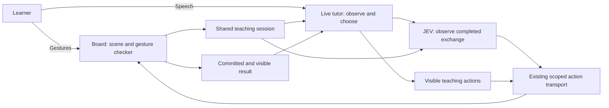

# Tutor-owned teaching on a shared workspace

Implemented first slice: Counting Board in `/lumina/live-activity`, 2026-09-19.

**Architecture direction, subsequent user instruction 2026-09-19:** the legacy
scripted approach is to be sunset. Existing standalone controllers described here
are temporary compatibility, not the permanent end state. Follow the
[LA-14 retirement handoff](../../../../qa/live-runtime-handoffs/07-sunset-scripted-tutoring.md)
for extraction, real-entry migration, evidence parity and deletion gates.

## Ordinary lesson wiring and completion (S2)

Counting Board `count` and Shape Sorter `identify` now use this runtime through
`LessonScreen` and `OrderedSection`, in both Kindergarten and scroll layouts.
**User clarification:** completing an assignment with the tutor counts as ordinary
primitive completion. The primitives submit through the existing evaluation provider,
with attempts, corrections and assistance preserved. There is no separate practice-only
completion or mastery-eligibility gate. The earlier bench-only/no-write descriptions
below are historical. See [S2 wiring report](../../../../qa/tutor-reports/lesson-workspace-wiring-2026-09-19.md)
for exact mode scope, data mapping and verification limits.

## What changed, and what carries forward

| Step | Counting Board change | Reusable responsibility |
|---|---|---|
| Executable workspace | The tutor sees the current objects and can mark them without selecting for the learner. | Primitive supplies truthful scene facts and legal operations; runtime supplies scoped execution and visible receipts. |
| Tutor-owned teaching | Live lessons bypass the scripted correction/re-ask/miss-cap runner. | One tutor chooses explanations, questions, and demonstrations. Standalone drills can keep their own controller. |
| Natural progression | Retry and advance disappeared from the tutor's advertised tools. | JEV observes a completed exchange; runtime commits an allowed outcome. Fluent narration alone changes nothing. |
| Tutor-first speech | The English-number parser and separate source-answer interpretation call were retired. | Speech opens a pending turn. JEV interprets the tutor's feedback; the fallible transcript is diagnostic, not a second speech judge. Structured gestures retain activity checks. |
| Whole-assignment grounding | Praise for eight objects in one row cannot finish an eighteen-object assignment. | Stable assignment + success condition + prior tutor question distinguish a substep from final success. |
| Browser turn settlement | Raw microphone activity stopped cancelling semantic observations; actual playback drain became an explicit signal. | Observe only after provider turn end and drained playback. New recognized words or a confirmed interruption cancel pending work. |
| Inspection | The JEV panel shows the assignment, model input, probabilities, and applied/refused result. | Keep the evidence chain inspectable across every adopted surface. |

The latest user session (`2026-09-19-190241-lumina-tutor-4aca92f0ac84`)
completed seven assignments: 4, 6, 7, 8, 5, 9, and 10 blocks. Seven observer
advances reached visible receipts, including noisy and multilingual transcripts;
five other observations abstained without granting success. The final runtime
settled as completed. This matches the user's positive experience report for this
sitting; it does not close every mode or the combined-lesson gate. Provider output
also contains a post-completion `<!-- silence -->` transcription; the logs alone
do not establish whether that was audible. See the compact evidence in
[the adoption report](../../../../qa/tutor-reports/shape-sorter-teaching-2026-09-19.md).

## Invariants for every new surface

| ID | Principle | Enforced or assessed by |
|---|---|---|
| TW-1 | Teaching may change the path; the original assignment and success condition stay fixed. | Domain assignment construction; JEV whole-assignment cases. |
| TW-2 | Teaching progress, a graded verdict, and permission to advance are separate. | JEV verdict/transition fields; observer and session tests. |
| TW-3 | Evidence authority follows the response channel: activity for gestures, tutor feedback for speech. | Shared workspace binding; real-model semantic probes. No transcript parser in front of speech. |
| TW-4 | Tutor demonstrations and examples never become learner work or attempts. | Separate scene/mark state; real-component assertions. |
| TW-5 | One tutor owns the conversation. An observer may classify an exchange but does not plan teaching or speak corrections. | Shared observer service and adapter guidance; transcript inspection. |
| TW-6 | Outcomes belong to one item and one response. Stale, interrupted, duplicate, or uncertain observations award no new success. | Epoch/instance/item/revision checks, response deduplication, cancellation tests. |
| TW-7 | Completion follows settled speech, committed state, and a visible receipt. These are different events. | Playback callback, transport/surface, mounted-host completion tests. |
| TW-8 | Assistance is monotonic within an item; hiding an aid or retrying does not erase it. | TeachingSession and runtime history. A fresh item starts fresh. |
| TW-9 | Every advertised action has a real, bounded visible effect; scene facts describe what is actually drawn. | Domain validation, synchronous command boundary, DOM checks. |
| TW-10 | New domains add task meaning and real operations, not new observer phrase rules or backend primitive branches. | Second adopter, unchanged shared observation lifecycle, registry-based journey. |
| TW-11 | Practice evidence is not automatically mastery evidence. Unrecorded help does not prove independence. | Dev host has no mastery writes; persistence requires its own data contract. |

**Scope refinement from the second adopter:** finalizing a pending spoken turn
changes conversational context, not the drawing or the legal demonstration targets.
It publishes updated context without changing tutor action tickets. New words still
cancel JEV observations, and a verdict operation still checks the exact response ID.
Scene, assignment, checked evidence, assistance, or tutor-affordance changes still
invalidate old tickets. No old command is retargeted to a new revision. Mounted
Counting Board and Shape Sorter tests reproduce the previous stale-demonstration
failure and cover this distinction.

TW-1 through TW-3 include semantic judgments, so their real-model regression cases
complement deterministic checks. None of the probability thresholds proves semantic
correctness or learning effectiveness.

**Second adopter: Shape Sorter `identify`.** The same assignment/observer/runtime
now names a gold-ringed shape. A side count, color, or name of a comparison shape
is intermediate progress. The expected name includes existing aliases such as
`rhombus or diamond`. Purple dashed demonstration rings never retarget the gold
assignment ring. The same SVG geometry draws the standalone and live surfaces.
The live registry deliberately advertises only plain-shape identification in this
pilot; count, sort, and real-object modes remain standalone and need their own
adoption evidence. No new JEV criteria, backend domain branches, or teaching state
machine were needed. Verification and remaining gates are in the report above.
Shape identification passed 42/42 real JEV replay cases and 3/3 full connected audio
journeys after the scope/guidance fixes. Its human browser/mic sitting remains open;
an additional Counting Board run missed a requested demonstration, so tool-choice
reliability remains follow-up work even though its progression regression passed.

**Shape Sorter's siblings, 2026-09-22.** `count`, `sort` and `find_real_object`
(challenge type `identify-real-object`) joined `identify` on the workspace, closing
the primitive's part-migration: every catalog mode now binds. `count` and a
real-object `identify` publish one object alone (no comparison pool — the standalone
drill never draws one either); `sort` additionally publishes its printed mats as
demonstrable objects, since they are labelled at every tier. `count` and
`find_real_object` are connected-journey verified (1/1 each); `sort` passed 0/5
connected runs, every failure the LA-13 sub-threshold-affirmation shape (a real,
correct tutor credit the observer refuses under 0.9 confidence) rather than a broken
mechanism — one run's first item passed cleanly at 0.98/0.94 before its second item
hit the same wall. `sort`'s mat labels ("3 sides", "Curved") are, by construction,
the same words a natural intermediate strategy question uses, which concentrates the
family-wide LA-13 risk on this mode. [Report](../../../../qa/tutor-reports/shape-sorter-siblings-teaching-2026-09-22.md).

**Third adopter: Number Train, five spoken modes.** `count_from`, `before_after`,
`fill_missing`, `spot_error` and `decade_fill` bind the same assignment/observer/
runtime: the glowing car marks the space in question, the other cars are visible
context, and demonstration marks whole cars without filling one. `spot-error` draws
no assignment target at all — its question is which printed number breaks the count —
and neither its facts nor any car carries the replacement. A multi-ask train fills the
slots it has already answered and no others. No new observer criteria per mode, no
backend branch and no teaching state machine were needed; the one shared change was a
`correct`-criterion sentence saying a very short agreement that names the expected
answer still credits the learner. Evidence and limits:
[third-adopter report](../../../../qa/tutor-reports/number-sequencer-teaching-2026-09-19.md).

**`order_cards` is withheld, and its reason is a framework gap.** The arrangement is
activity-checked, which is correct, but a checked-wrong manipulation leaves the session
in `checked` and the surface locked until an observer transition reopens the item — and
the learner-owned **Try again** exists only in the development host. Until the ordinary
lesson shell owns that control, no gesture mode should be admitted to lesson entry.

**Fourth adopter: di-letter-sounds, 2026-09-19.** The first adopter outside math and
the first migrated DI pack. Its assignment is a *produced sound*, which exposed two
limits of the current contract rather than a missing capability. First, the tutor's
affirmation and its own model of the sound use the same words, so a reply like "that is
the sound" classifies at 0.83–0.89 and the observer abstains — safe, since the item
stays open and the still-open cue fires, but it costs a turn. Second, a synthetic-audio
journey cannot certify this family at all: TTS of a held phoneme is not a child
producing one, and the tutor correctly judged what it was actually sent as wrong.
Spoken evidence for produced-sound tasks therefore depends on a human microphone
sitting. Its demonstration targets are whole objects (the stimulus card, the keyword
picture) on the existing contract; no new operation or observer rule was added.
[Report](../../../../qa/tutor-reports/di-letter-sounds-teaching-2026-09-19.md).

**Fifth adopter: di-word-reading, 2026-09-20 — and the adopter that says pause.** DI pack
#2, four modes, one act. Two constraints are new. First, **the answer is the stimulus**:
the child reads print, so `askFor` never names the word (a tutor reading the task aloud
would hand over the answer), while the word stays in `workspace.objects` and the facts
because the tutor must have it to judge. Second, **the reward picture is not a workspace
object** — as one the tutor could name it before the read, which is the same leak the
pack's answer-leak rule blocks on screen but spoken. It is revealed in a read-words trail
keyed on committed correct attempts, because `apply_tutor_verdict` submits and advances
in one `flushSync` and there is no `phase === 'affirmed'` to key off. A decodable word
publishes its printed letters as separate demonstration targets, so marking one is the
real sound-out gesture; an irregular sight word publishes none, so sounding one out is
refused by the scene rather than by guidance.

Its audio gate ran and passed the channel letter sounds could not: a synthesised whole
word transcribes correctly, and a connected run closed `dog` → retry, `cat` → success,
`mat` → success to completion. But the sub-threshold-affirmation finding reproduced here
too — `correct @ 0.86` for "You did it!" after a corrective turn, which stalled a live
lesson — so it is **not** specific to produced sound, and the next work is LA-13's shared
criterion rather than a sixth adopter. Two success-condition clauses were tried in the
primitive's own layer and both reverted; one had no effect and one only nudged a single
case onto the threshold while costing certainty elsewhere.
[Report](../../../../qa/tutor-reports/di-word-reading-teaching-2026-09-20.md).

**Sixth adopter: di-math-facts, 2026-09-20 — the adopter that narrows LA-13.** DI pack #3,
five modes, one act: meet the printed problem, say the number out loud. Its answer is
neither printed on the screen nor a produced phoneme, which is what makes it the cheapest
test of the question the pause above was called for. Three constraints are new. First, **the answer is neither drawn nor withholdable**:
unlike word reading the answer is nowhere on screen, yet the tutor must have it to judge, so
the scene cannot prevent the tutor saying it first and only the guidance can. `name_numeral`
inverts within the pack — the printed numeral IS the answer — so its content gate is
inverted rather than exempted. Second, **answer-key desync is a gate**: the tutor judges the
answer WORD while the evaluation records the NUMERAL, so an item whose word does not match
`spokenIntegerWord(numeral)` is refused on both sides of the wire. Third, **the completed
equation is keyed on the committed attempt**, small and secondary, because the standalone
drill's in-place reward beat needs a `phase === 'affirmed'` window this path does not have.

Its LA-13 result is the reason it is here. The sub-threshold-affirmation case that scored
0.83–0.89 for letter sounds and 0.86 for word reading scores **0.95–0.96 accepted** on a
spoken number, and a variant controlled for the prior turn naming the target still scores
0.94–0.95. The failing line is therefore not produced sound; it is whether **the child's
answer and the tutor's own model are the same utterance in the same channel**. A separate
abstention did stall one connected run, and a deterministic seven-cell isolation shows the
reply *names the answer* and is still refused — what rescues it is a relational credit
phrase. On this pack, naming the answer back produces the DISTAR model line verbatim, so
word reading's remedy does not generalise. Both results are shared-criterion input; nothing
was patched in the primitive's layer.
[Report](../../../../qa/tutor-reports/di-math-facts-teaching-2026-09-20.md).

**Seventh adopter: letter-sound-link, 2026-09-20 — the first binding with two channels,
and the first whose tutor is not told the answer.** The first literacy primitive outside the
DI packs. `see_hear` says the sound a printed letter makes, `keyword_match` says the picture
word that starts with it, and `hear_see` TAPS one of two confusable letters. Because a
letter NAME is a blocked response class, `hear_see` publishes **no `expectedAnswer`** — the
activity owns the check, both cards carry one shared group so nothing in the scene marks the
target, and the workspace advertises **no `demonstrate`**, since every object on that stage
is an answer option and marking either one answers for the child. Two capabilities the
contract had never been asked for, and neither needed a new observer rule. The keyword anchor
is not a workspace object in any mode: it encodes the sound, so it is drawn only on a
committed correct attempt and is absent from the `see_hear` packet entirely.

Its LA-13 result contradicts the sixth adopter's reading. The `wrong_then_corrected` shape is
ACCEPTED here at 0.94–0.96 on a produced sound — exactly where "the child's answer and the
tutor's own model are the same utterance in the same channel" predicts failure. What abstains
3/3 is a reply whose entire content is the answer token ("Yes, /t/.", "Yes, sss."), while the
same exchange in a sentence scores 0.99–1.00. One primitive-layer change was measured and
kept: naming the letter's NAME in the success condition took a false affirm of "Yes, em is
right!" from 2/3 accepted to 0/3, which is stating the success condition the way the two
sibling directions already did.
[Report](../../../../qa/tutor-reports/letter-sound-link-teaching-2026-09-20.md).

## Governing principle: completion belongs to the assignment

**Teaching can change the path; only evidence satisfying the original assignment
can change its completion state.** A tutor may decompose, demonstrate, rephrase,
switch languages, or ask a smaller question without replacing what the item assesses.
The original question and success condition stay stable until an explicit item change.

For an 18-object assignment, an answer of eight to a first-row question can be
excellent progress while the assignment remains unresolved. Confirmation of the
final total eighteen can establish success. An explanation question after that
confirmation can keep the conversation on the item without undoing the success.

This gives the framework four responsibilities, implemented by existing layers:

| Responsibility | Contract | Current implementation |
|---|---|---|
| Define the assignment | Stable item identity, original question, expected final answer, response channel, task constraints | `TeachingItem`, primitive item derivation |
| Supply evidence | Current learner work, prior tutor question, completed reply, assistance, turn identity and item scope | `TeachingWorkspace`, `DialogueRequest` |
| Interpret evidence | Does feedback concern the whole assignment? Does its result agree with the success condition? Is feedback finished? | Shared `observeDialogue` service |
| Commit the outcome | Record at most once for that response, preserve attempts/support, validate scope, apply an allowed transition and expose its visible result | `TeachingSession`, `DialogueObserver`, `LiveLessonRuntime` |

The task defines correctness. Evidence authority depends on the response channel:
the activity checks structured gestures; the live tutor hears speech, and JEV
interprets its feedback against the assignment. A noisy transcript is not a second
speech grader. Positive wording alone is not evidence that the assignment was solved.

Keep three concepts separate: **instructional progress**, **assignment verdict**,
and **permission to advance**. Intermediate progress can be acknowledged without
creating a graded attempt. A correct final answer can be recorded while a follow-up
question remains open. An uncertain observation leaves conversation available and
awards no success credit; it is not an incorrect answer.

## How this becomes an enforceable framework

Types make observations explicit; they do not prove their educational meaning.
Use different verification for the two kinds of guarantees:

| Guarantee | How it is established |
|---|---|
| Old-item responses cannot affect a new item; duplicate commits do not repeat credit; gestures cannot be overridden by praise | Deterministic runtime validation and tests |
| Intermediate praise is not full success; an affirmed result matches the expected final answer; a follow-up question remains open | Shared JEV criteria plus real-model regression cases |
| Accepted success produces the intended board change, sound, and eventual summary | Mounted-host tests and connected journeys |

A high model score is neither a correctness proof nor a visible UI receipt. The
inspector must expose assignment, evidence, model input, classification, and runtime
disposition so a failure can be attributed to the responsible layer.

For another primitive, provide its assignment and success condition, meaningful
scene facts, response checker where applicable, and executable teaching actions.
Reuse the observation and completion lifecycle. Add domain code for real differences
in tasks or interactions; do not add phrase triggers or a progression tool per mode.
The current `expectedAnswer` is a string suitable for bounded answers. A future
open-ended task needs an explicit rubric and evidence contract; giving the existing
field a vague sentence does not establish rubric-based assessment.

Each adoption must exercise the same behavioral matrix with its own domain examples:

| Exchange or event | Required result |
|---|---|
| Correct intermediate step | Assignment stays open; no final success credit or sound |
| Final result consistent with assignment, feedback finished | Record success and advance visibly |
| Correct final result followed by an explanation question | Record success, remain on the item |
| Tutor affirms a final result that conflicts with expected answer | No success commit |
| Help, example, or generic encouragement | Conversation continues without a graded answer |
| Accepted multilingual/noisy speech | Same outcome as an equivalent clear answer |
| Wrong answer followed by correction | Preserve earlier attempt and assistance; accept the correction |
| Interruption, late result, or duplicate delivery | No stale or duplicate outcome |
| Last item completed | Success feedback and final summary occur once after settlement |

Counting Board supplies the first evidence for this matrix. Shape Sorter identification
is the second real binding, alongside the earlier nonnumeric fixture. Its checks must
be read at their stated layer: mocked decisions prove lifecycle mechanics; real JEV
replays assess classification; connected journeys assess actual tool use and teaching.
Extend the existing contract only when an adoption exposes a concrete missing capability.

The failure was architectural. The live board sent exact correction sentences, the
judged runner interpreted tutor speech as its control protocol, and help was mostly
a re-ask or a reminder. A learner could receive the same correction twice and then
be moved on without the tutor having taught the missing concept.

The live board now uses the existing live model to choose its teaching actions.
It publishes the current task, visible objects, learner selections, recent attempts,
and available actions. It neither prescribes correction speech nor advances at a
miss cap. The existing SVG board is the workspace: a demonstration visibly marks
actual objects without adding them to the learner's selection.

## Ownership

| Layer | Owns | Does not own |
|---|---|---|
| Live tutor | Spoken-answer judgment, explanation, questions, demonstration choices, natural feedback | Recording responses or calling retry/advance in observer workspaces |
| Shared dialogue observer | Recording the tutor's spoken verdict and transition after speech settles | Regrading learner transcripts, teaching plans, arbitrary state mutations |
| Primitive binding | Task meaning, visible scene, legal interactions, private answer checker | Correction scripts, a teaching state machine per mode |
| `TeachingSession` / `useTeachingWorkspace` | Attempts, assistance, response boundaries, shared help/check/retry/advance lifecycle | Number vocabulary or subject-specific pedagogy |
| Existing runtime and transport | Scope, revisions, policy, deduplication, commit/visibility receipts, closing speech settlement | Teaching strategy |

There is no second teaching planner. One bounded TypeSafe/JEV call observes each completed
exchange with pending learner speech or an activity-checked response. There is no
separate spoken-answer extraction service. The existing
`perform_runtime_action` tool accepts bounded `targets` parameters
for workspace actions; its action tickets retain instance/item/revision scope.

## Runtime invariants and semantic assessment rules

1. Help and demonstrations are not learner attempts. Tutor marks and learner
   selections have separate state. Clearing a demonstration does not erase help history.
2. Gesture submissions are checked by the activity. Spoken answers are judged by the
   live tutor, whose completed feedback is observed by JEV. A finalized learner turn
   opens a pending response; it does not need to pass an English answer parser.
   The observer compares that feedback with the original assignment and expected
   final answer, using the prior tutor question to distinguish intermediate steps.
   Praise for one row or group does not solve the whole assignment or play a success sound.
   Help, examples, and encouragement without a confident verdict remain ungraded.
   The tutor does not call a recording or progression tool.
3. Provider fragments are assembled by input stream, including empty final markers.
   When the provider omits its final flag, its response/tool-output boundary finalizes
   the input. Client VAD pauses alone do not finalize a count.
   Partial audio text, an old item's trailing speech, and answers spoken before a
   required stimulus/manipulation cannot be submitted as the current response.
4. A verdict and a transition are separate observations. Confident success with
   finished feedback can record the answer and advance in one scoped operation.
   Success followed by an open question records the verdict without advancing.
   Wrong answers never advance. There is no maximum-error skip.
5. Retry retains attempts and assistance. A new item starts with fresh work and fresh
   assistance state. Replaying a timed stimulus records assistance.
6. Hidden objects are absent from the tutor's visible scene. Mode constraints still
   govern flash timing, removal/addition, conservation, and pre-numeric matching.
7. Commands reject stale scopes and invalid parameters. A demonstration validates
   every target before changing anything. Completion follows the final visible
   receipt and speech settlement.

These are interaction and evidence invariants, not scripts for how to teach. A
one-to-one selection, timed flash, or count-on basket is mathematical task structure
and remains in the board. Exact correction wording and two-miss progression do not.

## Reuse contract

The 2026-09-19 user audio session exposed a separate transport gap: browser state
was attached to typed messages but never delivered to audio-only turns. The visible
mount receipt now includes the runtime packet, and the existing continuing activity
response streams subsequent state with SILENT scheduling. The live adapter does not
advertise legacy `advance_activity`. Conversational transcript changes alone no
longer invalidate action tickets. These are shared transport fixes, not new modes.

**Implemented observer boundary:** `DialogueObserver` consumes completed tutor speech,
learner speech and current assignment metadata. Its request includes the actual selected
object IDs/labels/groups, separate tutor demonstration marks, response source, attempt
count, assistance and browser-checked correctness. It sends a bounded snapshot, not a
raw click history. The existing JEV client classifies spoken verdict and conversational
transition independently. For pending speech, the model sees the assignment, tutor
reply, expected final answer, prior tutor turn, activity metadata, and presence of a learner turn. The fallible learner transcript
is retained as diagnostic context, but excluded from this model input so it cannot
veto an accepted answer in another language. The inspector exposes both the request
and the exact model input. Gesture correctness remains activity-owned.

Retry/advance are internal observer capabilities, omitted from tutor action tickets.
An accepted transition requires at least 0.9 selected-option probability, a winning
margin, a confident tutor verdict or checked gesture evidence, and matching
epoch/instance/item/revision. These are operational
thresholds, not a calibrated guarantee of correctness. Raw model confidence is retained
in the inspector, but is not a second threshold on the same choice. Classification waits for provider
turn completion and drained playback. New speech, interruption, stale state and teardown
invalidate pending decisions. No exact-word trigger or primitive-specific observer exists.

**Refusal reporting and settled turns (2026-09-19).** A refused observation reports
`confidence: 0`. It previously carried the transition probability through a refusal
whose transition had been forced to `none`, so a 0.95 sat beside a verdict the runtime
had rejected and read as proof the answer was recognized. Feedback completion is
published as `feedbackComplete` on its own, separately from the verdict and the
transition, so a stall can be attributed to the layer that produced it. When a tutor
turn settles with complete feedback and nothing is committed, the observer says once
per learner turn that the task is still open. That cue grants no credit, prescribes no
wording, and is withheld for an unfinished turn, a committed outcome, or a service
outage. Scene facts must not be nameable as the learner's answer: Counting Board's
`counted` became `markedOnBoard` because a spoken answer always leaves it at zero, and
a fact reading "the learner counted zero" contradicts a tutor affirming a correct count.

A new spoken turn replaces the pending turn and invalidates its unfinished observation;
the next tutor feedback can record a correction while retaining prior attempts and
assistance. Verdict recording and an accepted retry/advance commit atomically through
an observer-only workspace operation. Explicit learner Try again / Next challenge controls use
the same scope and visibility checks, so service failure/abstention does not trap the learner.
Automated progression still fails closed; ambiguous discussion or unanswered questions do
not move the board. After a visible advance, one factual cue requests the next task's
introduction. Final completion follows its visible receipt without another progression call.

This is enabled only in the development live host. It does not eliminate all tutor tools:
visible demonstrations and stimulus presentation remain executable model actions, and
`begin_help` still records verbal assistance. That remaining bookkeeping is a separate
boundary; unrecorded assistance is not evidence of independence.

A primitive supplies `TeachingItem[]` (identity, task, expected answer, response channel, checker),
the currently rendered `TeachingWorkspace` (objects, facts, presentation constraints,
mark/clear functions), and item-reset/stimulus callbacks. The shared hook provides
the lifecycle and executable actions. A nonnumeric color-selection test exercises
the same hook to check that it does not secretly depend on counting.

The current generalization covers selection workspaces and explicit responses.
Dragging, constructing, annotating, and open-ended explanations need their own
truthful domain operations/checkers. Do not add a generic arbitrary-state mutation
API or recreate per-mode teaching scripts. Shape identification supplies the second
binding; its evidence does not authorize a catalog migration or certify these other interactions.

## Observation kinds and learner signals (2026-09-20, every shared-workspace binding)

The outcome observer answers one question after a tutor turn: was the assignment solved.
Two additions answer the questions around it, without a second planner (TW-5).

**Learner signals (code, no model call).** `LearnerSignalTracker` lives on the runtime and
computes, per item: seconds on the item, since the task became ready, since the tutor last
settled and since the learner last spoke; learner and tutor turn counts; attempts, wrong
attempts, a repeated wrong response, recorded help; and the counts the learner-turn
observation feeds. They ride in the packet as `liveRuntime.learner.signals`, beside the
snapshot and never inside it, so a value that changes by the clock cannot move a revision
or invalidate an action ticket. They are refreshed on the publishes that already happen.
No timer publishes them and none speaks: silence alone establishes neither frustration nor
a misconception, and a quiet-nudge policy would need its own user ruling.

**Observation kinds (JEV).** `service/typesafe/observationKinds.ts` runs one kind: a fixed
question set, a bounded model input, a pure decision, a budget. `assignment_outcome` is the
existing verdict/feedback/transition trio, registered unchanged, and it stays the only kind
with a runtime consumer. `learner_intent` is the first advisory kind: three Nouls on a
finished LEARNER turn (asks for help, wants to stop, attempts an answer). Its model input
holds the task, the prior tutor turn and the learner's words, and never the expected
answer, so it cannot become a second speech grader (TW-3). Code holds the policy: a request
is raised at 0.8, an answer attempt is three-valued, and an unclear turn is reported as unclear.

| | `assignment_outcome` | `learner_intent` |
|---|---|---|
| Fires | After a settled tutor turn and drained playback | When a learner turn finishes, before the tutor's reply |
| May commit | Verdict, retry, advance | Nothing |
| Waited on | By progression | Never. A late result informs the following turn |
| Cancelled by | New learner words, interruption, scope change | New learner words, item change. Not a tutor reply or a revision bump |
| Reaches the tutor | As the visible transition | `liveRuntime.learner.observations` and the signal counts; a newly raised help or stop request sends one packet at the same revision |

Piloted on Counting Board behind an opt-in, then made general the same day: every
`useTeachingWorkspace` binding (`workspace.progression === 'observer'`) carries
`liveRuntime.learner` and gets the learner-turn observation, with nothing wired per
primitive. Legacy runner adapters are unchanged; a runner owns its own judge and clock.
The block carries its own one-sentence `about` note, because adapter guidance is capped at
2000 characters: the shared `WORKSPACE_DOCTRINE` (`adapters/adapterContract.ts`) takes 900 of
them and letter-sound-link sits at 1961. A binding owes a truthful
`readyForResponse`, `author: 'host'` on any non-silent message it writes itself, and a
domain case set. `LuminaAIContext` sends only learner-authored text down the learner-text
channel; a host-authored send (the checked-gesture facts) arrives as `runtime_host_text`,
which opens the next exchange for the outcome observer with no learner words and is
neither classified nor counted as a learner turn (2026-09-21; replaced a registry that
matched the host's own string and dropped it). A new kind needs its questions,
its decision, a real-model case set with a false-positive count, and a named consumer.
It does not need, and must not get, a primitive-specific branch (TW-10).
[Pilot report](../../../../qa/tutor-reports/counting-board-learner-signals-2026-09-20.md).

## Compatibility and evidence limits

The live host selects this controller and opts out of the old catalog DI scaffold.
`useCountingBoardRuntime` and its mode-specific reminder/misstep inventory were
removed. The standalone scripted drill still uses its existing controller. Both
controllers render the same board; the live controller has a small compatibility
facade for the existing view. Task derivation currently remains in
`countingBoardScript.ts`; only the standalone controller builds its cue pack.

Attempts are session-local evidence in the dev live host. They are deliberately
not converted into the legacy drill mastery score. Demonstration is conservatively
classified as full answer exposure. Verbal assistance depends on the tutor calling
`begin_help`; `assisted: false` means no recorded assistance, not proven independent
mastery. Persisting these records requires a separate student-data contract review.
Spoken attempts retain their tutor response and judgment provenance. An affirmation
of a final result that conflicts with the expected answer is not accepted. The observer
still relies on semantic classification of tutor feedback rather than independently
grading the original audio; it is not a guarantee against tutor or classifier errors.

The deterministic suite checks the shared mechanics across all ten board kinds.
Real-model journeys cover handover and spoken counting, with simulated learner
input through the real mounted component and WebSocket bridge. They do not prove
microphone recognition, browser visual quality, every mode's teaching quality, or
improved student learning. See the [dialogue observer trial](../../../../qa/tutor-reports/counting-board-dialogue-2026-09-19.md).
The subsequent [tutor-first speech verification](../../../../qa/tutor-reports/counting-board-tutor-primary-2026-09-19.md)
covers multilingual transcripts, verdict recording, success sounds, and settled summary completion.
